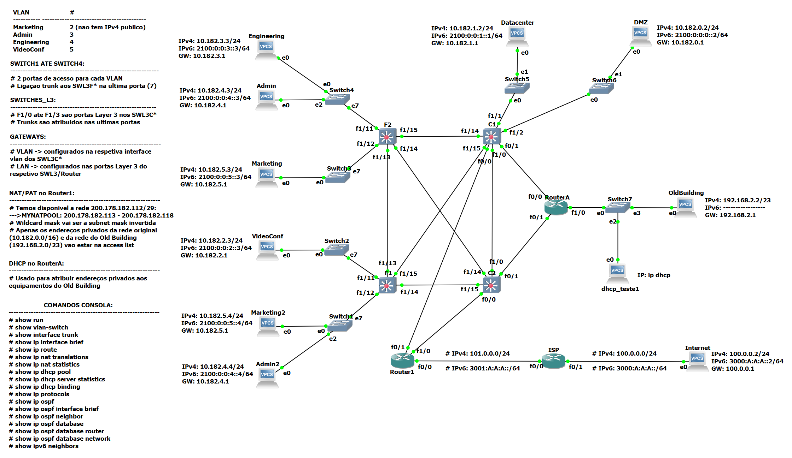

# Project_FR

### About the project
With the purpose of learning the fundamental principles, protocols and practice of networking, this project revolves around building a business communication network and a TCP Client-Server application. 

The [**communication network**](network_GNS3) is implemented in GNS3 and has the following characteristics:
  - Contains multiple CISCO components such as ethernet switches, layer 3 switches and routers 
  - Public and private IPv4 addressing, aswell as IPv6 
  - OSPF routing protocol on all L3 interfaces
  - NAT/PAT enabled 
  - DHCP server enabled
  - 4 distinct VLAN and 2 distinct LAN 
  - Full connectivity inside the network
  - Full connectivity with internet
  
  The [**TCP Client-Server application**](client_server_code) is implemented using python and allows multiple clients to periodically notify a central server of details such as their CPU utilization and percentage of memory in use.
   
  

### Detailed description/usage
Read the project report -> [**Objective1_Report.pdf**](Objective1_Report.pdf).

### Programming/Scripting/Markup Languages
`Python`
